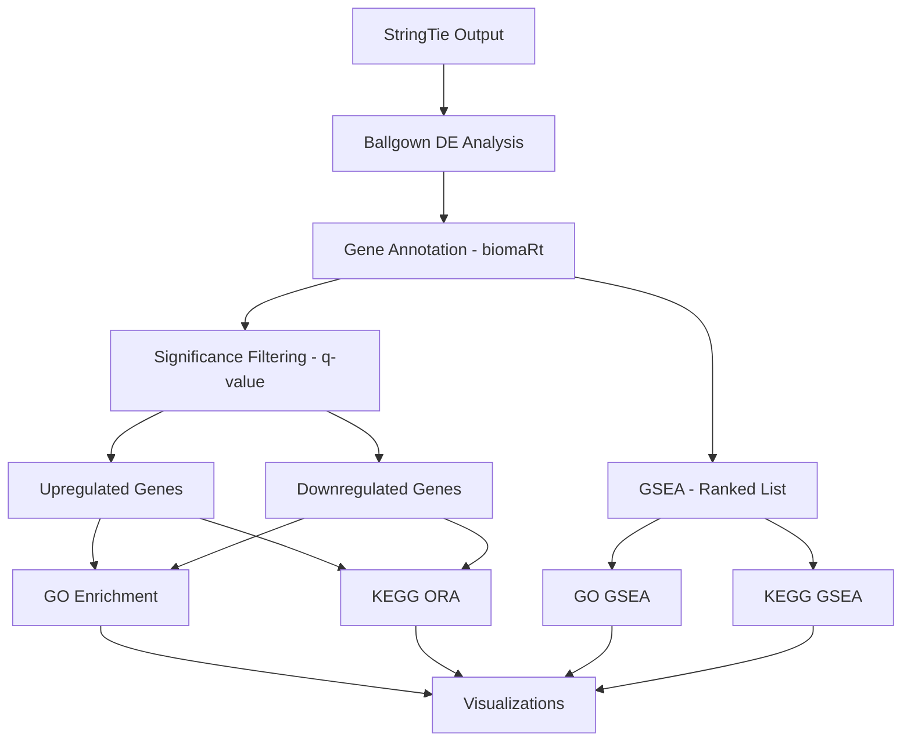

# RNA-seq Differential Expression Analysis Pipeline

A comprehensive pipeline for RNA-seq analysis from raw reads to functional enrichment, including differential expression analysis (Ballgown), gene annotation (biomaRt), functional enrichment (GO/KEGG), and immune cell deconvolution.

[](https://www.r-project.org/)
[](https://www.nextflow.io/)
[](https://bioconductor.org/)
[](https://opensource.org/licenses/MIT)

## 📋 Table of Contents

- [Overview](#overview)
- [Pipeline Workflow](#pipeline-workflow)
- [Requirements](#requirements)
- [Installation](#installation)
- [Quick Start](#quick-start)
- [Scripts Description](#scripts-description)
- [Input Data](#input-data)
- [Output Files](#output-files)
- [Visualization Gallery](#visualization-gallery)
- [Citation](#citation)
- [License](#license)

## 🔬 Overview

This pipeline performs end-to-end RNA-seq analysis:

1. **Read Alignment & Quantification** - nf-core/rnaseq (STAR + Salmon)
2. **Differential Expression** - Ballgown (gene-level DE with q-value filtering)
3. **Gene Annotation** - biomaRt (Ensembl ID → gene symbol)
4. **Functional Enrichment** - GO (topGO) and KEGG pathway analysis
5. **Immune Deconvolution** - immunedeconv (xCell method)

## 🔄 Pipeline Workflow

```
┌─────────────────────────────────────────────────────────────────────┐
│                        RAW FASTQ FILES                              │
└─────────────────────────────┬───────────────────────────────────────┘
                              │
                              ▼
┌─────────────────────────────────────────────────────────────────────┐
│              nf-core/rnaseq (nfcore_rnaseq.sh)                      │
│  • Quality control (FastQC)                                          │
│  • Trimming (TrimGalore)                                             │
│  • Alignment (STAR)                                                  │
│  • Quantification (Salmon)                                           │
│  • StringTie assembly (for Ballgown)                                 │
└─────────────────────────────┬───────────────────────────────────────┘
                              │
              ┌───────────────┴───────────────┐
              ▼                               ▼
┌──────────────────────────┐    ┌──────────────────────────────────┐
│  Ballgown .ctab files    │    │  salmon.merged.gene_counts.tsv   │
└────────────┬─────────────┘    └──────────────┬───────────────────┘
             │                                  │
             ▼                                  ▼
┌──────────────────────────┐    ┌──────────────────────────────────┐
│ ballgown_corrected.R     │    │  immune_deconvolution.R          │
│ • DE analysis (q-value)  │    │  • xCell deconvolution           │
│ • Gene annotation        │    │  • Immune cell composition       │
│ • Visualizations         │    │  • Visualizations                │
└────────────┬─────────────┘    └──────────────────────────────────┘
             │
             ▼
┌──────────────────────────────────────────────────────────────────────┐
│           functional_enrichment_qvalue.R                             │
│  • GO enrichment (topGO + clusterProfiler)                           │
│  • KEGG pathway analysis (ORA + GSEA)                                │
│  • Network visualizations                                            │
└──────────────────────────────────────────────────────────────────────┘
```

## ✨ Features

- **Complete pipeline**: From raw reads to functional interpretation
- **Proper statistical thresholds**: Uses q-value (FDR) instead of p-value
- **Comprehensive filtering**: Relaxed (q < 0.05) and stringent (q < 0.05 & |log2FC| ≥ 1)
- **Symmetric analysis**: Handles both upregulated and downregulated genes
- **Multiple enrichment methods**: ORA and GSEA
- **Immune profiling**: Cell type deconvolution from bulk RNA-seq
- **Publication-ready visualizations**

## 📦 Requirements

### Software

- Nextflow ≥ 21.10 (for nf-core pipeline)
- Docker or Singularity
- R ≥ 4.0
- Bioconductor ≥ 3.18

### R Packages

```r
# Run install_packages.R to install all dependencies
source("install_packages.R")
```

## 🚀 Quick Start

```bash
# 1. Clone repository
git clone https://github.com/chumawinnie/rnaseq-de-pipeline.git
cd rnaseq-de-pipeline

# 2. Run alignment (modify paths in script first)
bash nfcore_rnaseq.sh

# 3. In R, run differential expression
source("ballgown_corrected.R")

# 4. Run functional enrichment
source("functional_enrichment_qvalue.R")

# 5. (Optional) Run immune deconvolution
source("immune_deconvolution.R")
```

## 📜 Scripts Description

| Script | Purpose | Input | Output |
|--------|---------|-------|--------|
| `nfcore_rnaseq.sh` | Run nf-core/rnaseq pipeline | FASTQ files | BAM, counts, StringTie output |
| `custom.config` | Nextflow resource configuration | - | - |
| `ballgown_corrected.R` | Differential expression analysis | .ballgown folders | DE results, plots |
| `functional_enrichment_qvalue.R` | GO/KEGG enrichment | DE results CSV | Enrichment results, plots |
| `immune_deconvolution.R` | Immune cell composition | Gene counts | Deconvolution results |
| `install_packages.R` | Install all R dependencies | - | - |

### Script Details

#### 1. `nfcore_rnaseq.sh`
Runs the nf-core/rnaseq pipeline with STAR + Salmon alignment. Outputs include:
- Aligned BAM files
- Gene count matrices
- StringTie assemblies (for Ballgown)
- MultiQC report

#### 2. `ballgown_corrected.R`
Performs gene-level differential expression using Ballgown with:
- **Q-value (FDR) filtering** - NOT p-value
- biomaRt gene annotation
- Publication-ready visualizations (volcano, heatmap, PCA)

#### 3. `functional_enrichment_qvalue.R`
Comprehensive enrichment analysis:
- GO enrichment (topGO + clusterProfiler)
- KEGG pathway analysis
- Both ORA and GSEA methods
- Symmetric up/down analysis

#### 4. `immune_deconvolution.R`
Estimates immune cell composition using xCell method

## 📂 Input Data

### Directory Structure

```
project_directory/
├── README.md
├── LICENSE
├── CHANGELOG.md
├── .gitignore
│
├── # Pipeline Scripts
├── nfcore_rnaseq.sh              # Step 1: Alignment pipeline
├── custom.config                  # Nextflow configuration
├── ballgown_corrected.R          # Step 2: DE analysis
├── functional_enrichment_qvalue.R # Step 3: Enrichment
├── immune_deconvolution.R        # Step 4: Immune profiling
├── install_packages.R            # Dependency installer
│
├── # Input Data
├── metadata.csv                   # Sample metadata
├── WT01_TUMOR.ballgown/          # Ballgown folders
├── WT02_TUMOR.ballgown/
├── ...
│
└── # Output (generated)
└── results/
    ├── all_genes_DE_results.csv
    ├── plots/
    └── enrichment/
```

### Metadata File Format

The `metadata.csv` file must have these columns:

| ids | patient | condition |
|-----|---------|-----------|
| WT01_TUMOR.ballgown | WT01 | TUMOR |
| WT02_TUMOR.ballgown | WT02 | TUMOR |
| WT03_NORMAL.ballgown | WT03 | NORMAL |

**Important**: The `ids` column must exactly match the folder names (including `.ballgown` suffix).

## 🚀 Usage

### Step 1: Differential Expression Analysis

```r
# Set working directory to your data folder
setwd("/path/to/your/Ballgown")

# Run the DE analysis
source("ballgown_corrected.R")
```

### Step 2: Functional Enrichment Analysis

```r
# Run enrichment analysis (after DE analysis)
source("functional_enrichment_qvalue.R")
```

### Customizing Thresholds

Edit the threshold variables at the top of each script:

```r
# In ballgown_corrected.R and functional_enrichment_qvalue.R
qval_cutoff <- 0.05      # FDR threshold
log2fc_cutoff <- 1       # Fold change threshold (2-fold)
```

## 📁 Output Files

### Differential Expression Results

```
results/
├── all_genes_DE_results.csv          # All genes with annotations
├── significant_genes_q05.csv         # q < 0.05
├── significant_genes_stringent.csv   # q < 0.05 & |log2FC| ≥ 1
├── significant_upregulated.csv       # q < 0.05, log2FC > 0
├── significant_downregulated.csv     # q < 0.05, log2FC < 0
├── significant_upregulated_stringent.csv    # log2FC ≥ 1
├── significant_downregulated_stringent.csv  # log2FC ≤ -1
├── gene_expression_FPKM.csv          # Expression matrix
├── gene_expression_log2FPKM.csv      # Log2-transformed
└── plots/
    ├── volcano_plot_qvalue.png       # Main volcano (USE THIS)
    ├── volcano_plot_pvalue.png       # For reference
    ├── heatmap_top_genes.png
    ├── PCA_plot.png
    ├── MA_plot.png
    ├── sample_correlation_heatmap.png
    ├── expression_boxplot.png
    ├── top_genes_barplot.png
    ├── qvalue_histogram.png
    ├── pvalue_histogram.png
    └── ...
```

### Enrichment Results

```
results/enrichment/
├── GO/
│   ├── GO_BP_results.csv             # topGO Biological Process
│   ├── GO_MF_results.csv             # topGO Molecular Function
│   ├── GO_CC_results.csv             # topGO Cellular Component
│   ├── GO_all_results.csv            # Combined topGO
│   ├── GO_BP_clusterProfiler.csv     # clusterProfiler BP
│   └── GO_GSEA_BP.csv                # GO GSEA results
├── KEGG/
│   ├── KEGG_ORA_all.csv              # All significant genes
│   ├── KEGG_ORA_upregulated.csv      # Upregulated genes
│   ├── KEGG_ORA_downregulated.csv    # Downregulated genes
│   ├── KEGG_ORA_upregulated_stringent.csv
│   ├── KEGG_ORA_downregulated_stringent.csv
│   ├── KEGG_GSEA.csv                 # GSEA results
│   └── hsa***.pathview.png           # Pathway maps
└── plots/
    ├── GO_BP_barplot.png
    ├── GO_MF_barplot.png
    ├── GO_CC_barplot.png
    ├── GO_combined_dotplot.png
    ├── GO_BP_enrichment_map.png
    ├── GO_BP_cnetplot.png
    ├── GO_BP_treeplot.png
    ├── GO_BP_upset.png
    ├── KEGG_ORA_dotplot.png
    ├── KEGG_ORA_barplot.png
    ├── KEGG_ORA_upregulated_dotplot.png
    ├── KEGG_ORA_downregulated_dotplot.png
    ├── KEGG_GSEA_dotplot.png
    ├── KEGG_GSEA_ridgeplot.png
    └── KEGG_GSEA_running_score.png
```

## 📊 Visualization Gallery

### Differential Expression

| Volcano Plot (q-value) | Heatmap | PCA |
|:---:|:---:|:---:|
|  |  |  |

### Functional Enrichment

| GO Enrichment | KEGG Pathways | Gene-Concept Network |
|:---:|:---:|:---:|
|  |  |  |

## 🔄 Pipeline Workflow



## 📖 Methods Description

For publications, you can adapt the following methods text:

> **Differential Expression Analysis**: Gene-level differential expression was performed using Ballgown (v2.30.0) with FPKM values. Low-variance genes were filtered (variance > 1) before statistical testing. Significance was determined using FDR-adjusted p-values (q-value < 0.05) with a fold change threshold of |log2FC| ≥ 1 for stringent analysis.
>
> **Gene Annotation**: Ensembl gene IDs were mapped to gene symbols using biomaRt (v2.54.0) querying Ensembl release 110.
>
> **Functional Enrichment**: Gene Ontology enrichment was performed using topGO (v2.50.0) with the weight01 algorithm and clusterProfiler (v4.6.0). KEGG pathway analysis was conducted using over-representation analysis (ORA) for significant gene sets and Gene Set Enrichment Analysis (GSEA) using ranked gene lists (sign(log2FC) × -log10(q-value)).

## ⚠️ Important Notes

### Why q-value instead of p-value?

When testing thousands of genes, p-value alone leads to many false positives. The q-value (FDR-adjusted p-value) controls the expected proportion of false discoveries:

| Threshold | Testing 20,000 genes | Expected false positives |
|-----------|---------------------|-------------------------|
| p < 0.05 | ~1,000 | ~1,000 (5%) |
| q < 0.05 | Variable | ~5% of significant genes |

### Handling Imbalanced Results

If you observe more significant genes in one direction (e.g., only downregulated), this is often a **real biological signal**, not an error. Common in:
- Cancer vs normal tissue (loss of differentiation)
- Knockout experiments (loss of function)
- Drug treatments (suppression of pathways)

## 🐛 Troubleshooting

### Common Issues

1. **"first column of pData does not match"**
   - Ensure `ids` column in metadata.csv exactly matches folder names
   - Include `.ballgown` suffix in the ids

2. **"unable to find inherited method for select"**
   - Add `select <- dplyr::select` after loading libraries

3. **Warnings about deprecated arguments**
   - These are warnings, not errors. The analysis still completes successfully.

## 📚 Citation

If you use this pipeline, please cite:

```
Ballgown: Frazee AC, et al. (2015) Nature Biotechnology 33:243-246
topGO: Alexa A, Rahnenfuhrer J (2023) topGO: Enrichment Analysis
clusterProfiler: Wu T, et al. (2021) The Innovation 2:100141
```

## 📄 License

This project is licensed under the MIT License - see the [LICENSE](LICENSE) file for details.

## 👤 Author

Created by chukwuma winner obiora

---

**Note**: This pipeline was developed for research purposes. Always validate results with independent methods for clinical applications.
